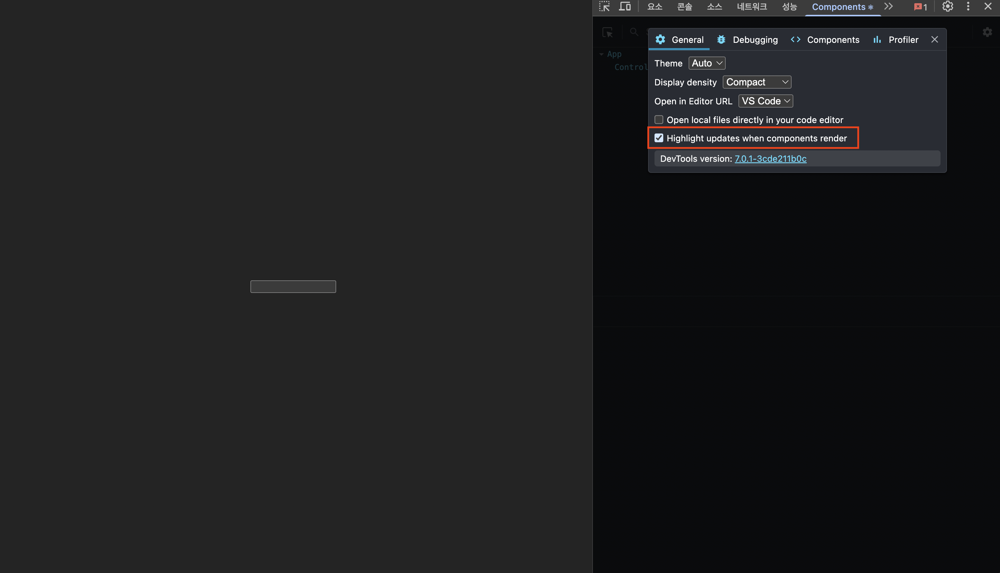

# React란 무엇인가?

React는 사용자 인터페이스(UI)를 만들기 위한 JavaScript 라이브러리입니다.

## 🎯 React의 특징

### 1. 컴포넌트 기반

React는 UI를 **독립적이고 재사용 가능한 컴포넌트**로 나누어 개발합니다.

```tsx
// 간단한 컴포넌트 예시
const Welcome = () => {
  return <h1>안녕하세요!</h1>;
};

export default Welcome;
```

### 2. 선언적 UI

React는 **선언적**으로 UI를 작성합니다. 상태에 따라 UI가 어떻게 보여야 하는지만 정의하면, React가 알아서 업데이트합니다.

```tsx
// 상태에 따라 UI가 자동으로 변경됩니다
{isLoggedIn ? <Dashboard /> : <LoginForm />}
```

### 3. Virtual DOM

React는 Virtual DOM을 사용하여 **효율적인 업데이트**를 수행합니다.

- 실제 DOM을 직접 조작하지 않음
- 변경사항을 Virtual DOM에서 먼저 처리
- 최소한의 변경만 실제 DOM에 반영

## 🌟 왜 React를 사용할까?

### 재사용성
컴포넌트를 한 번 만들면 여러 곳에서 재사용 가능합니다.

### 생산성
복잡한 UI를 작은 조각으로 나누어 관리하기 쉽습니다.

### 커뮤니티
전 세계적으로 가장 큰 프론트엔드 커뮤니티를 보유하고 있습니다.

### 생태계
다양한 라이브러리와 도구가 준비되어 있습니다.

## 🔍 React의 핵심 개념

1. **컴포넌트 (Component)**: UI를 구성하는 독립적인 블록
2. **JSX**: JavaScript + XML, HTML처럼 보이는 문법
3. **Props**: 부모 → 자식으로 데이터 전달 (단방향)
   - 참고: Vue, Angular는 양방향 바인딩(Two-way Binding)도 지원
4. **State**: 컴포넌트의 상태 관리
5. **Hooks**: 함수형 컴포넌트에서 상태와 생명주기 사용

## 🔄 단방향 데이터 흐름 (One-way Data Flow)

React의 가장 중요한 특징 중 하나는 **단방향 데이터 흐름**입니다.

### 데이터는 위에서 아래로만 흐릅니다

```
부모 컴포넌트
    ↓ (Props로 데이터 전달)
자식 컴포넌트
    ↓ (Props로 데이터 전달)
손자 컴포넌트
```

### 양방향 바인딩 vs 단방향 데이터 흐름

React는 **단방향 데이터 흐름**만 지원하는 반면, Vue와 Angular는 **양방향 바인딩**도 지원합니다.

**양방향 바인딩 (Vue, Angular):**
```
뷰(View) ↔ 모델(Model)
서로 자동으로 동기화됨

예시 (Vue):
<input v-model="message" />
→ input 값 변경 시 message 자동 업데이트
→ message 변경 시 input 값도 자동 업데이트
```

**단방향 데이터 흐름 (React):**
```
데이터 → 뷰
뷰의 이벤트 → 데이터 업데이트 → 뷰

예시 (React):
<input value={message} onChange={(e) => setMessage(e.target.value)} />
→ input 값 변경 시 명시적으로 setMessage 호출 필요
→ 명시적인 제어가 필요하지만, 데이터 흐름이 명확함
```

### 단방향 흐름의 장점

**1. 예측 가능성**
- 데이터가 한 방향으로만 흐르므로 버그 추적이 쉬움
- 어디서 데이터가 변경되는지 명확함

**2. 디버깅 용이**
```tsx
import { useState } from 'react';

const Child = ({ count }) => {
  // 자식은 Props를 읽기만 가능
  // count를 직접 수정할 수 없음!
  return <p>Child count: {count}</p>;
};

const Parent = () => {
  const [count, setCount] = useState(0);

  return (
    <div>
      <p>Parent count: {count}</p>
      {/* 데이터는 부모 → 자식으로만 전달 */}
      <Child count={count} />
    </div>
  );
};

export default Parent;
```

**3. 데이터 변경 추적**

자식이 데이터를 변경하려면 부모로부터 받은 콜백 함수를 사용해야 합니다:

```tsx
import { useState } from 'react';

const Child = ({ count, onIncrement }) => {
  return (
    <div>
      <p>Child sees: {count}</p>
      {/* 부모의 함수를 호출하여 데이터 변경 요청 */}
      <button onClick={onIncrement}>증가</button>
    </div>
  );
};

const Parent = () => {
  const [count, setCount] = useState(0);

  const increment = () => {
    setCount(prev => prev + 1);
  };

  return (
    <div>
      <p>Count: {count}</p>
      {/* 데이터와 함께 변경 함수도 전달 */}
      <Child count={count} onIncrement={increment} />
    </div>
  );
};

export default Parent;
```

### 🎯 실습: 직접 실행해보기

위의 코드를 실제로 실행하여 단방향 데이터 흐름을 확인해봅시다!

**1단계: Parent 컴포넌트 파일 생성**

`src/components/Parent.tsx` 파일을 생성합니다:

```bash
mkdir -p src/components
touch src/components/Parent.tsx
```

**2단계: Parent.tsx 코드 작성**

```tsx
import { useState } from 'react';

// 자식 컴포넌트
const Child = ({ count, onIncrement }: { count: number; onIncrement: () => void }) => {
  return (
    <div style={{ padding: '20px', border: '2px solid blue', margin: '10px' }}>
      <h3>자식 컴포넌트</h3>
      <p>부모로부터 받은 count: {count}</p>
      <button onClick={onIncrement}>증가 버튼 (부모 함수 호출)</button>
    </div>
  );
};

// 부모 컴포넌트
const Parent = () => {
  const [count, setCount] = useState(0);

  const increment = () => {
    setCount((prevCount) => prevCount + 1);
  };

  return (
    <div style={{ padding: '20px', border: '2px solid red' }}>
      <h2>부모 컴포넌트</h2>
      <p>부모의 count: {count}</p>

      {/* 자식에게 count와 increment 함수 전달 */}
      <Child count={count} onIncrement={increment} />
    </div>
  );
};

export default Parent;
```

**3단계: App.tsx 수정**

`src/App.tsx` 파일을 열어 기존 코드를 삭제하고 Parent 컴포넌트로 변경합니다:

```tsx
import Parent from './components/Parent';
import './App.css';

const App = () => {
  return (
    <div className="App">
      <h1>단방향 데이터 흐름 예제</h1>
      <Parent />
    </div>
  );
};

export default App;
```

**4단계: 개발 서버 실행 및 확인**

```bash
pnpm dev
```

브라우저에서 http://localhost:5173 을 열고 다음을 확인하세요:

1. **부모 컴포넌트**의 count 값
2. **자식 컴포넌트**의 count 값 (같은 값)
3. 자식의 "증가 버튼" 클릭
4. **부모와 자식 모두** count 값이 증가함

**5단계: 개발자 도구로 데이터 흐름 관찰**

1. F12로 개발자 도구 열기
2. React DevTools 설치 (Chrome/Edge 확장 프로그램)
3. Components 탭 선택

4. Parent → Child 구조 확인
5. 버튼 클릭하며 count 값 변화 관찰

**핵심 포인트:**
- 자식은 `count` 값을 **직접 변경할 수 없음**
- 자식은 부모로부터 받은 `onIncrement` 함수를 **호출**만 함
- 실제 데이터 변경은 **부모에서만** 발생 (`setCount`)
- 변경된 데이터가 다시 자식에게 전달됨 (단방향 흐름)

**데이터 흐름:**
```
1. Parent가 count state를 소유
2. Child에게 count와 increment 함수를 Props로 전달
3. Child는 버튼 클릭 시 onIncrement 호출
4. Parent의 setCount가 실행되어 count 업데이트
5. 새로운 count가 Child에게 다시 전달됨
```

### 왜 단방향일까?

**문제 상황 (양방향이라면):**
```
Parent의 count = 5
  ↓
Child가 count를 3으로 변경
  ↓
Parent의 count도 자동으로 3이 됨
  ↓
다른 컴포넌트들도 영향을 받음
  ↓
어디서 변경됐는지 추적 어려움!
```

**React의 해결 방법 (단방향):**
```
Parent의 count = 5
  ↓
Child는 count를 읽기만 가능
  ↓
Child가 변경을 원하면 onIncrement 호출
  ↓
Parent만이 count를 변경할 수 있음
  ↓
변경의 출처가 명확함!
```

## 다음 단계

다음 장에서는 JSX 문법에 대해 자세히 알아보겠습니다.
